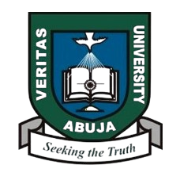

# Emerge 2026 - AI Showcase Platform

A premium, modern web application for the Veritas University AI Showcase event. Built with React, TypeScript, and Vite, featuring a cohesive "hybrid" aesthetic that blends futuristic design with physical ticket-inspired elements.



## Features

### **Digital Entry Pass System**
- **Downloadable Tickets**: High-resolution PNG export with 3x pixel ratio
- **Hybrid Design**: Physical ticket-inspired aesthetic with notched edges and geometric patterns
- **Official Branding**: Integrated Veritas University logo and official styling

### **People's Choice Voting**
- Real-time voting system for participant projects
- One vote per device limitation
- Admin analytics dashboard for tracking popularity

###  **Admin Dashboard**
- Registration management and filtering
- Real-time statistics and data visualization
- CSV export functionality
- Voting analytics integration

### **Fully Responsive**
- Optimized for mobile, tablet, and desktop devices
- Premium glassmorphism effects and animations
- Consistent user experience across all breakpoints

### **Hybrid Modern Aesthetic**
- Geometric dot patterns and glowing accents
- Cohesive design language across all pages
- Futuristic typography and color palette

## Tech Stack

- **Framework**: React 19.2.0 with TypeScript
- **Build Tool**: Vite 7.2.4
- **Styling**: Tailwind CSS 4.1.18
- **Animations**: Framer Motion 12.29.2
- **Form Management**: React Hook Form 7.71.1 + Zod 4.3.6
- **Routing**: React Router DOM 7.13.0
- **Icons**: Lucide React 0.563.0
- **Image Export**: html-to-image

## Getting Started

### Prerequisites
- Node.js (v18 or higher)
- npm or yarn

### Installation

```bash
# Clone the repository
git clone <repository-url>

# Navigate to project directory
cd "AI SHOW SYSTEM"

# Install dependencies
npm install

# Start development server
npm run dev
```

### Build for Production

```bash
# Create production build
npm run build

# Preview production build
npm run preview
```

## 📁 Project Structure

```
AI SHOW SYSTEM/
├── src/
│   ├── assets/          # Images and static assets
│   ├── components/      # Reusable components
│   │   └── layout/      # Layout components (Navbar, Footer)
│   ├── pages/           # Page components
│   │   ├── Home.tsx     # Landing page with countdown
│   │   ├── Register.tsx # Registration forms
│   │   ├── Gallery.tsx  # Project showcase
│   │   ├── Schedule.tsx # Event timeline
│   │   ├── Vote.tsx     # Voting interface
│   │   ├── Admin.tsx    # Admin dashboard
│   │   └── Login.tsx    # Admin authentication
│   ├── App.tsx          # Main app component
│   └── index.css        # Global styles
├── public/              # Public assets
└── package.json         # Dependencies
```

## Key Pages

### Home
- Hero section with countdown timer
- Event details (date, time, venue)
- Core technologies showcase

### Register
- Multi-tab registration (Participant, Organizer, Alumni)
- Form validation with Zod schemas
- Digital badge generation and download


### Vote
- People's Choice voting interface
- Project nomination display
- One-vote-per-device enforcement

### Admin
- Protected route with authentication
- Registration statistics and analytics
- Data export and management tools
- Voting results tracking

## Design System

### Color Palette
- **Primary**: Showcase Cyan (`#00F7FF`)
- **Secondary**: Showcase Blue (`#1A3C5E`)
- **Dark**: Showcase Dark (`#0A0E1A`)
- **Accent**: White with opacity variations

### Typography
- **Headings**: Black weight, italic styling
- **Body**: Medium weight, tracking adjustments
- **Labels**: Bold uppercase with wide tracking

## 🔐 Admin Access

Default admin credentials are stored in localStorage. For production deployment, implement proper backend authentication.

## 📝 License

This project is developed for Veritas University's Department of Computer Science.

## Credits

**Event Details:**
- **Date**: Friday, January 30th, 2026
- **Time**: 9:00 AM
- **Venue**: New LT Theatre
- **HOD**: Assoc. Prof Joe Essien
- **Organizer**: Dr. Felix Uloko

---

Built with for Emerge 2026 - Veritas University AI Showcase
